---
## Front matter
lang: ru-RU
title: Отчёт по лабораторной работе №1
subtitle: Простейший шаблон
author:
  - Абрамян А. А.
institute:
  - Российский университет дружбы народов, Москва, Россия
date: 2023, 09 сентября Москва, Россия

## i18n babel
babel-lang: russian
babel-otherlangs: english

## Formatting pdf
toc: false
toc-title: Содержание
slide_level: 2
aspectratio: 169
section-titles: true
theme: metropolis
header-includes:
 - \metroset{progressbar=frametitle,sectionpage=progressbar,numbering=fraction}
 - '\makeatletter'
 - '\beamer@ignorenonframefalse'
 - '\makeatother'
---

## Прагматика

- решить поставленную задчу;
- решить возникающие трудности и проблемы;
- практически получить полезный результат;

## Цель работы

- В данной лабораторной работе мне было необходимо приобрести практические навыки
установки операционной системы на виртуальную машину, настройки минимально необходимых для дальнейшей работы сервисов.

## Выполнение лабораторной работы

1. Создайте новую виртуальную машину. Для этого в VirtualBox выберите "Машина" "Создать".
Укажите имя виртуальной машины (ваш логин в дисплейном классе), тип
операционной системы — Linux, RedHat. (рис. \ref{img1}) 

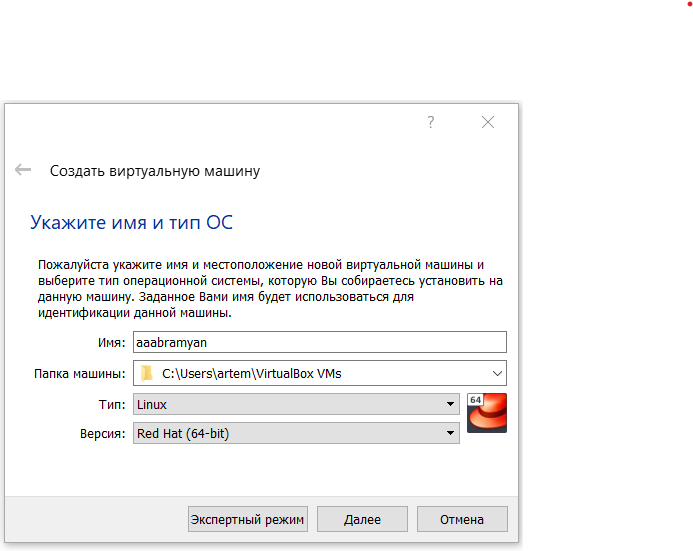{ width=70% }

## Выполнение лабораторной работы

2. Укажите размер основной памяти виртуальной машины - 2048 МБ (или большее число, кратное 1024 МБ, 
если позволяют технические характеристики вашего компьютера). (рис. \ref{img2})

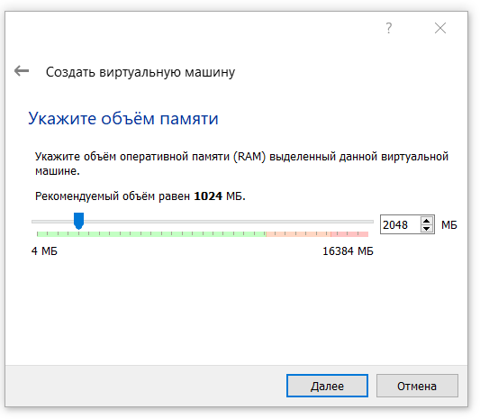{ width=70% }

## Выполнение лабораторной работы

3. Задайте конфигурацию жёсткого диска — загрузочный,VDI (BirtualBox Disk
Image), динамический виртуальный диск. (рис. \ref{img3})

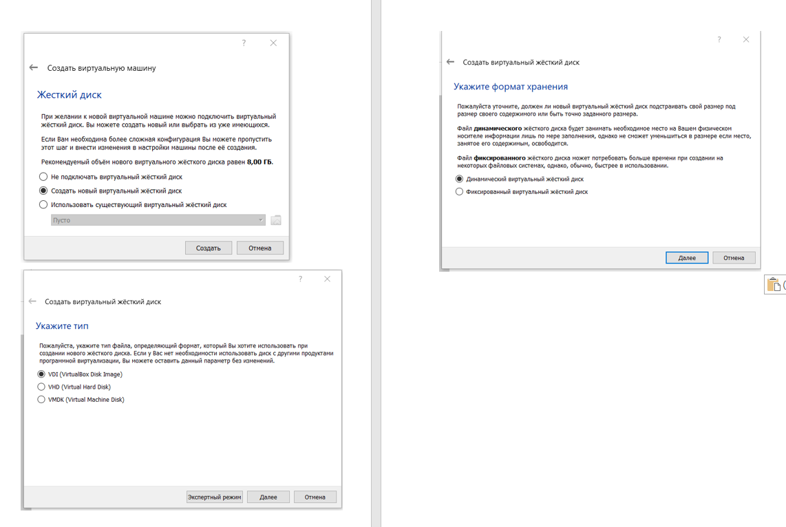{ width=70% }

## Выполнение лабораторной работы

4. Задайте размер диска — 40 ГБ (или больше), его расположение. (рис. \ref{img4})

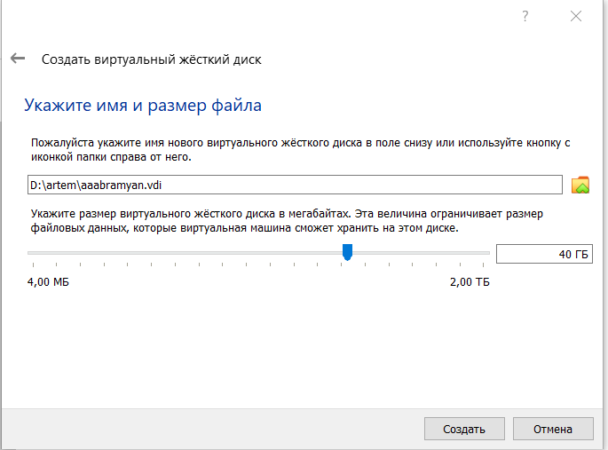{ width=70% }

## Выполнение лабораторной работы

5. Выберите в VirtualBox для Вашей виртуальной машины "Настройки"
"Носители". Добавьте новый привод оптических дисков и выберите образ
операционной системы. (рис. \ref{img5})

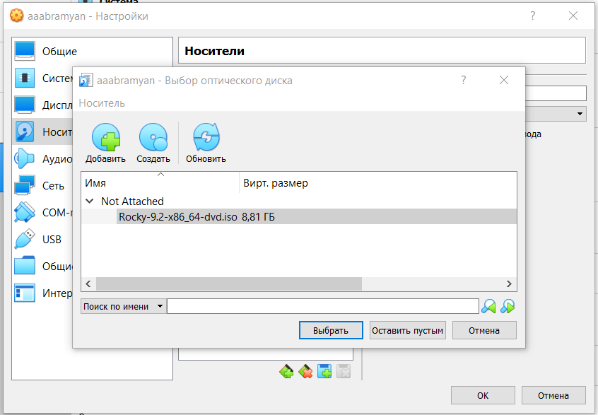{ width=70% }

## Выполнение лабораторной работы

6. Запустите виртуальную машину, выберите English в качестве языка интерфейса и перейдите к настройкам установки операционной
системы. (рис. \ref{img6})

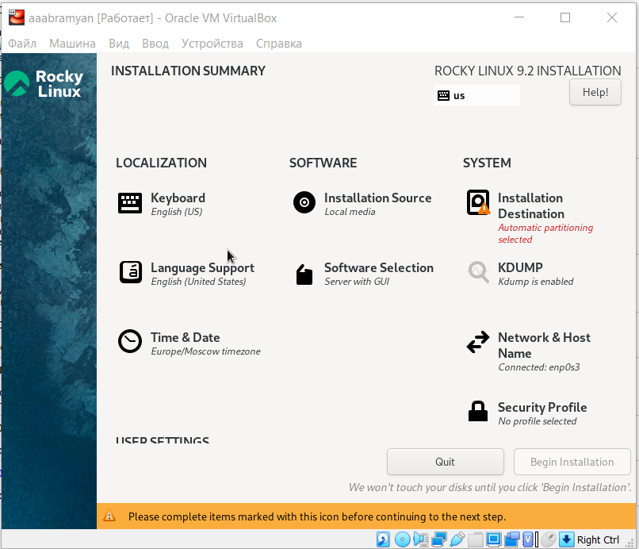{ width=70% }

## Выполнение лабораторной работы

7. В разделе выбора программ укажите в качестве базового окружения
"Server with GUI", а в качестве дополнения — "Development Tools". (рис. \ref{img7})

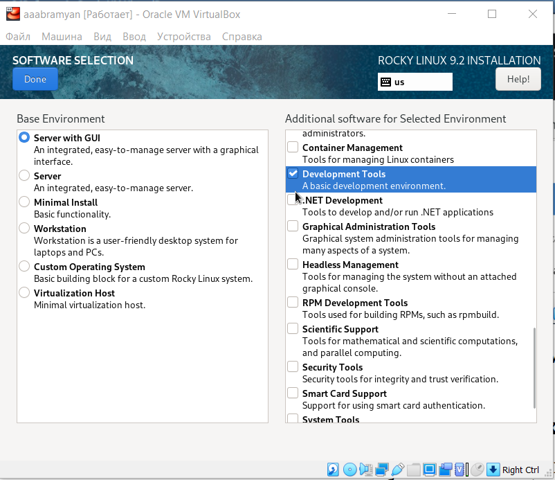{ width=70% }

## Выполнение лабораторной работы

8. Отключите KDUMP.(рис. \ref{img8})

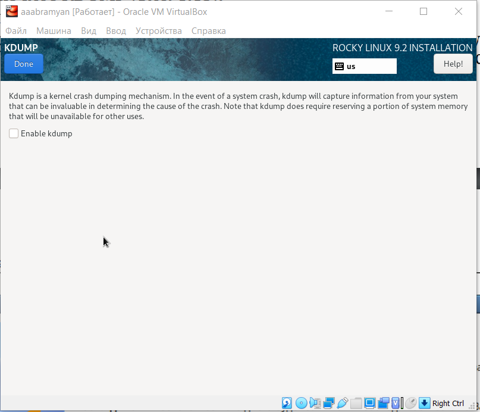{ width=70% }

## Выполнение лабораторной работы

9. Место установки ОС оставьте без изменения.(рис. \ref{img9})

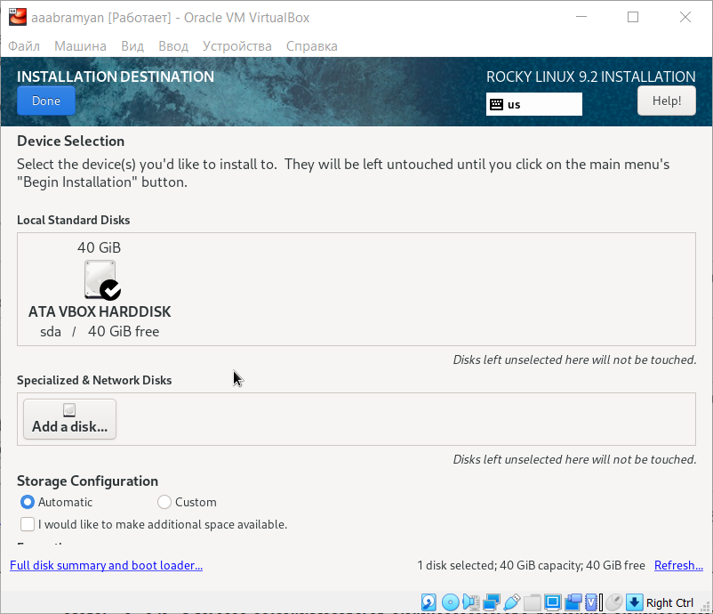{ width=70% }

## Выполнение лабораторной работы

10. Включите сетевое соединение и в качестве имени узла укажите
user.localdomain , где вместо user укажите имя своего пользователя в соответствии с соглашением об именовании.(рис. \ref{img10})

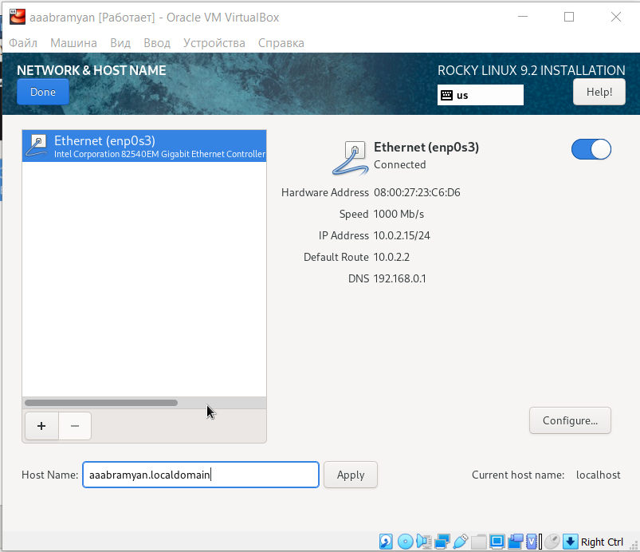{ width=70% }

## Выполнение лабораторной работы

11. Установите пароль для root и пользователя с правами администратора.(рис. \ref{img11})

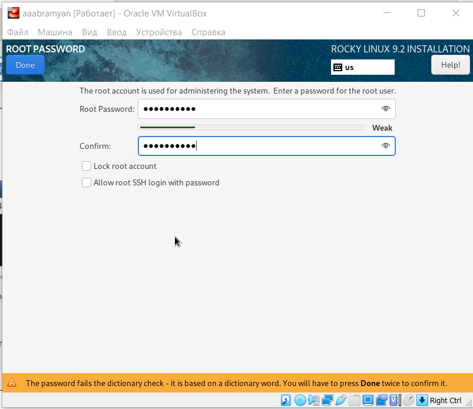{ width=70% }

## Выполнение лабораторной работы

12. После завершения установки операционной системы корректно перезапустите виртуальную машину и примите условия лицензии.(рис. \ref{img12})

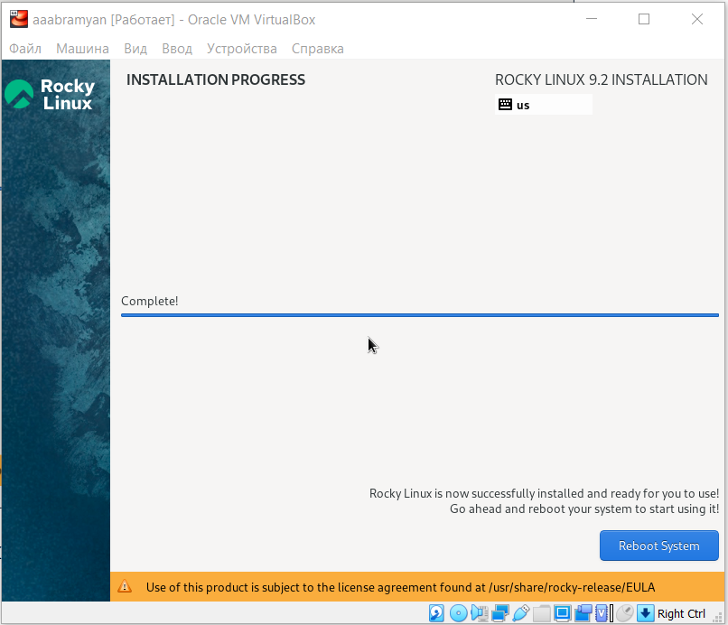{ width=70% }

## Выполнение лабораторной работы

13. Создадим пользователя.(рис. \ref{img13})

{ width=70% }

## Результаты

- В данной лабораторной работе мне успешно удалось приобрести практические навыки
установки операционной системы на виртуальную машину, настройки минимально необходимых для дальнейшей работы сервисов.

