---
## Front matter
title: "Отчёт по лабораторной работе №1"
subtitle: "дисциплина: Информационная безопасность"
author: "Абрамян Артём Арменович"

## Generic otions
lang: ru-RU
toc-title: "Содержание"

## Bibliography
bibliography: bib/cite.bib
csl: pandoc/csl/gost-r-7-0-5-2008-numeric.csl

## Pdf output format
toc: true # Table of contents
toc-depth: 2
lof: true # List of figures
lot: true # List of tables
fontsize: 12pt
linestretch: 1.5
papersize: a4
documentclass: scrreprt
## I18n polyglossia
polyglossia-lang:
  name: russian
  options:
	- spelling=modern
	- babelshorthands=true
polyglossia-otherlangs:
  name: english
## I18n babel
babel-lang: russian
babel-otherlangs: english
## Fonts
mainfont: PT Serif
romanfont: PT Serif
sansfont: PT Sans
monofont: PT Mono
mainfontoptions: Ligatures=TeX
romanfontoptions: Ligatures=TeX
sansfontoptions: Ligatures=TeX,Scale=MatchLowercase
monofontoptions: Scale=MatchLowercase,Scale=0.9
## Biblatex
biblatex: true
biblio-style: "gost-numeric"
biblatexoptions:
  - parentracker=true
  - backend=biber
  - hyperref=auto
  - language=auto
  - autolang=other*
  - citestyle=gost-numeric
## Pandoc-crossref LaTeX customization
figureTitle: "Рис."
tableTitle: "Таблица"
listingTitle: "Листинг"
lofTitle: "Список иллюстраций"
lotTitle: "Список таблиц"
lolTitle: "Листинги"
## Misc options
indent: true
header-includes:
  - \usepackage{indentfirst}
  - \usepackage{float} # keep figures where there are in the text
  - \floatplacement{figure}{H} # keep figures where there are in the text
---

# Цель работы

В данной лабораторной работе мне было необходимо приобрести практические навыки
установки операционной системы на виртуальную машину, настройки минимально необходимых для дальнейшей работы сервисов.

# Задание

Здесь приводится описание задания в соответствии с рекомендациями
методического пособия и выданным вариантом.

# Теоретическое введение

Лабораторная работа подразумевает установку на виртуальную машину
VirtualBox (https://www.virtualbox.org/) операционной системы Linux
(дистрибутив Rocky (https://rockylinux.org/) или CentOS (https://
www.centos.org/)).
Выполнение работы возможно как в дисплейном классе факультета
физико-математических и естественных наук РУДН, так и дома. Описание
выполнения работы приведено для дисплейного класса со следующими характеристиками:
– Intel Core i3-550 3.2 GHz, 4 GB оперативной памяти, 20 GB свободного
места на жёстком диске;
– ОС Linux Gentoo (http://www.gentoo.ru/);
– VirtualBox верс. 6.1 или старше;
– каталог с образами ОС для работающих в дисплейном классе:
/afs/dk.sci.pfu.edu.ru/common/files/iso/.

# Выполнение лабораторной работы

1. Создайте новую виртуальную машину. Для этого в VirtualBox выберите "Машина" "Создать".
Укажите имя виртуальной машины (ваш логин в дисплейном классе), тип
операционной системы — Linux, RedHat. (рис. \ref{img1}) 

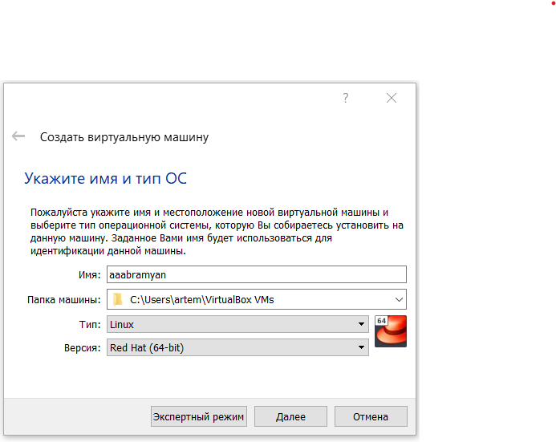{ width=70% }

2. Укажите размер основной памяти виртуальной машины - 2048 МБ (или большее число, кратное 1024 МБ, 
если позволяют технические характеристики вашего компьютера). (рис. \ref{img2})

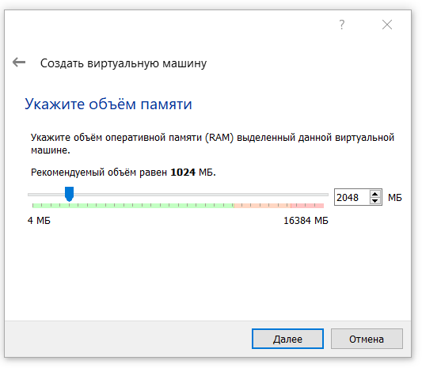{ width=70% }

3. Задайте конфигурацию жёсткого диска — загрузочный,VDI (BirtualBox Disk
Image), динамический виртуальный диск. (рис. \ref{img3})

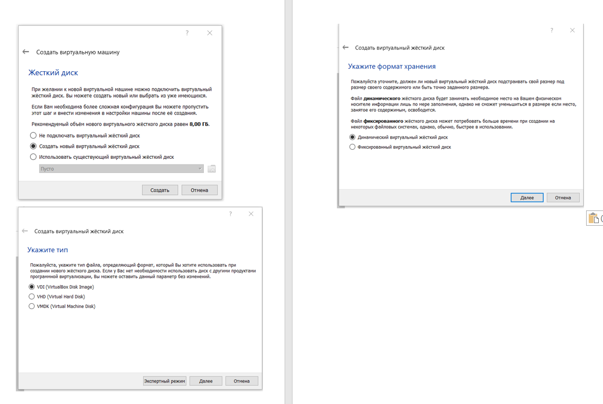{ width=70% }

4. Задайте размер диска — 40 ГБ (или больше), его расположение. (рис. \ref{img4})

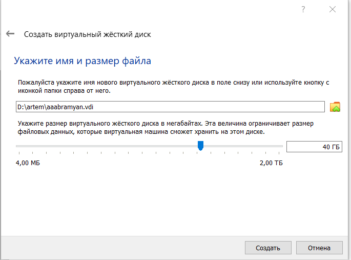{ width=70% }

5. Выберите в VirtualBox для Вашей виртуальной машины "Настройки"
"Носители". Добавьте новый привод оптических дисков и выберите образ
операционной системы. (рис. \ref{img5})

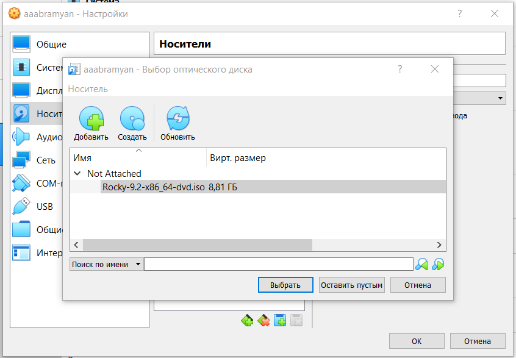{ width=70% }

6. Запустите виртуальную машину, выберите English в качестве языка интерфейса и перейдите к настройкам установки операционной
системы. (рис. \ref{img6})

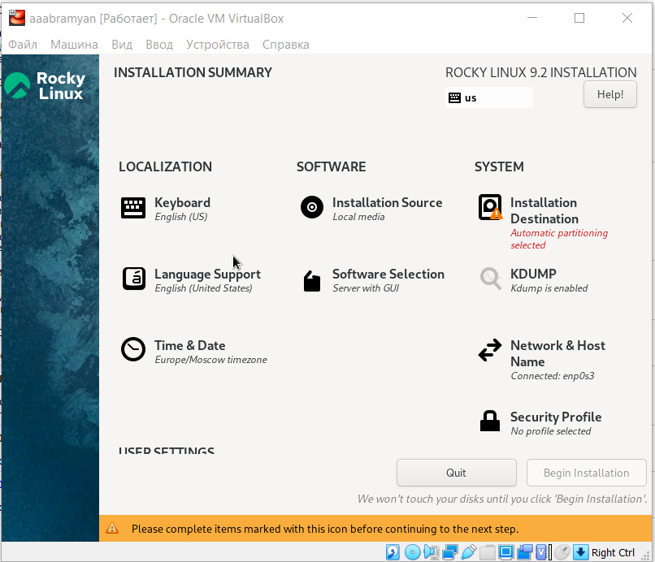{ width=70% }

7. В разделе выбора программ укажите в качестве базового окружения
"Server with GUI", а в качестве дополнения — "Development Tools". (рис. \ref{img7})

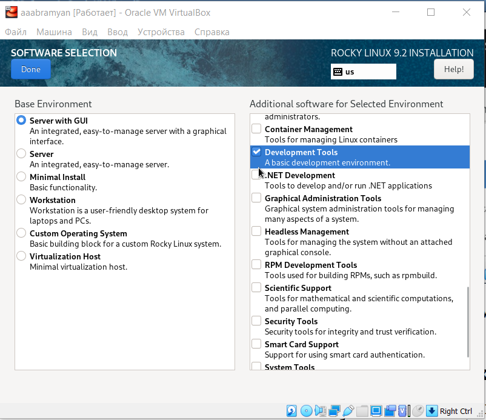{ width=70% }

8. Отключите KDUMP.(рис. \ref{img8})

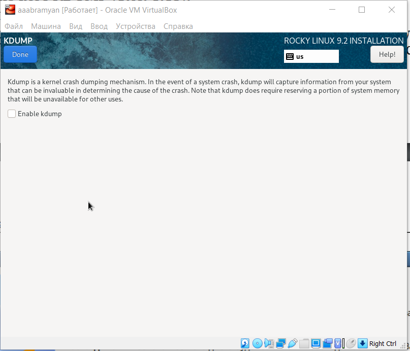{ width=70% }

9. Место установки ОС оставьте без изменения.(рис. \ref{img9})

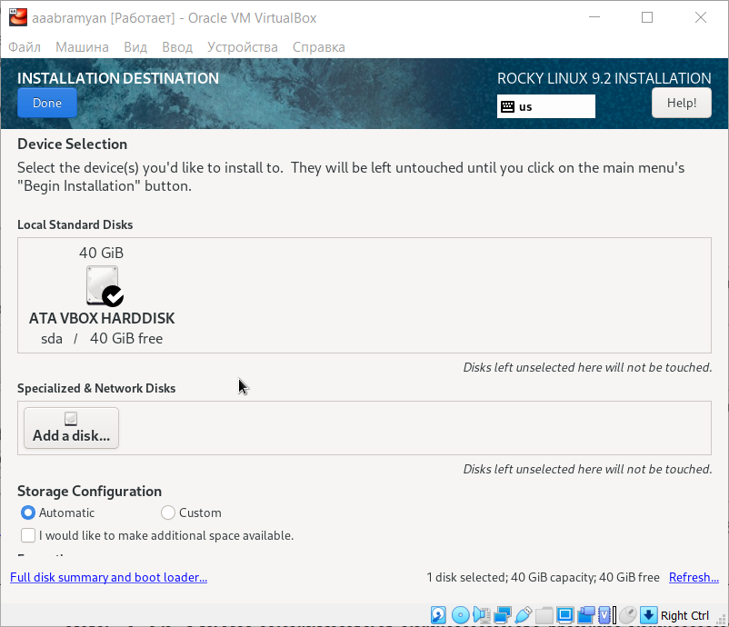{ width=70% }

10. Включите сетевое соединение и в качестве имени узла укажите
user.localdomain , где вместо user укажите имя своего пользователя в соответствии с соглашением об именовании.(рис. \ref{img10})

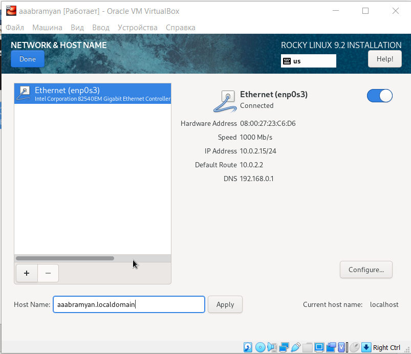{ width=70% }

11. Установите пароль для root и пользователя с правами администратора.(рис. \ref{img11})

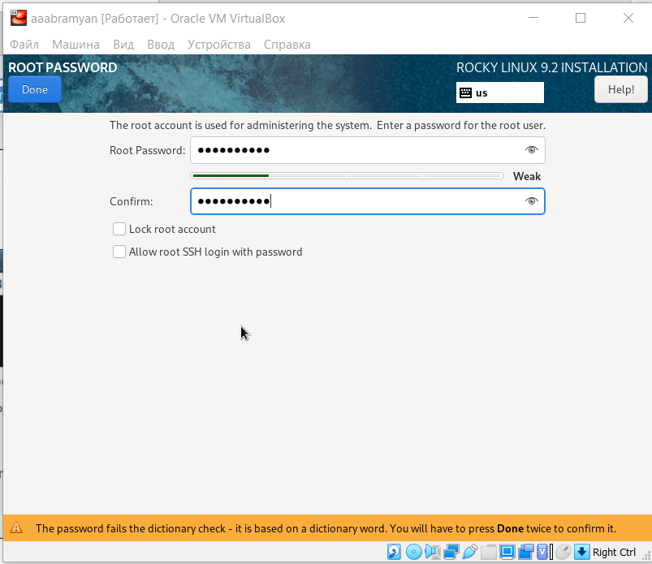{ width=70% }

12. После завершения установки операционной системы корректно перезапустите виртуальную машину и примите условия лицензии.(рис. \ref{img12})

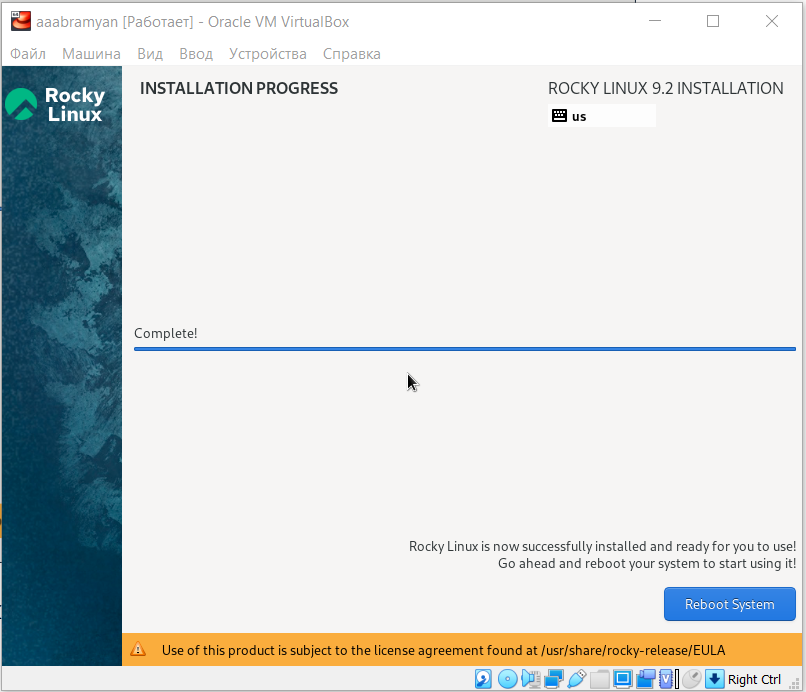{ width=70% }

13. Создадим пользователя.(рис. \ref{img13})

{ width=70% }

# Домашнее задание

1. Дождитесь загрузки графического окружения и откройте терминал. В окне терминала проанализируйте 
последовательность загрузки системы, выполнив команду dmesg. (рис. \ref{img14}) 

{ width=70% }

2. Можно просто просмотреть вывод этой команды: dmesg less (рис. \ref{img15}) 

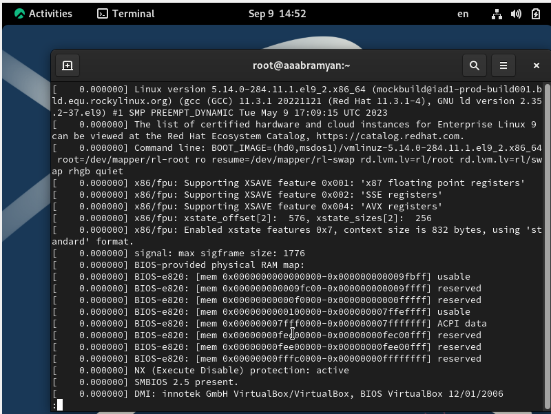{ width=70% }

3. Получим следующую информацию:
Версия ядра Linux (Linux version).
Частота процессора (Detected Mhz processor).
Модель процессора (CPU0).
Объем доступной оперативной памяти (Memory available).
Тип обнаруженного гипервизора (Hypervisor detected).
Тип файловой системы корневого раздела. (рис. \ref{img16}) 

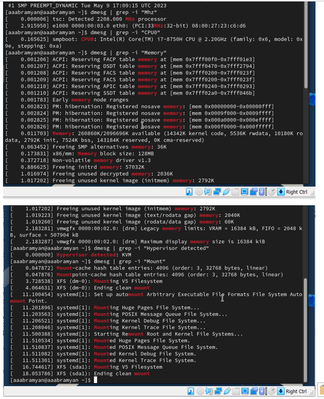{ width=70% }

# Контрольные вопросы

1. Какую информацию содержит учётная запись пользователя?
Учетная запись пользователя - это необходимая для системы информация
о пользователе, которая хранится в специальных файлах. Вся информация
о пользователе обычно хранится в файлах /etc/passwd и /etc/group. Учетная
запись пользователя содержит: имя пользователя (user name), идентификационный номер группы (GID), идентификационный номер пользователя
(UID), пароль (password), полное имя (full name), домашний каталог (home
directory), начальную оболочку (login shell).

2. Укажите команды терминала и приведите примеры:
– для получения справки по команде;
– для перемещения по файловой системе;
– для просмотра содержимого каталога;
– для определения объёма каталога;
– для создания / удаления каталогов / файлов;
– для задания определённых прав на файл / каталог;
– для просмотра истории команд.

Для получения справки по команде: man команда. Например, команда
“man ls” выведет справку о команде “ls”.

Для перемещения по файловой системе: cd путь. Например, команда
“cd newdir” осуществляет переход в каталог newdir.

Для просмотра содержимого каталога: ls опции путь. Например, команда “ls -a ~/newdir” отобразит имена скрытых файлов в каталоге
newdir.

Для определения объёма каталога: du опция путь. Например, команда
“du -k ~/newdir” выведет размер каталога newdir в килобайтах.

Для создания / удаления каталогов / файлов: mkdir опции путь /
rmdir опции путь / rm опции путь. Например, команда “mkdir -p
~/newdir1/newdir2” создаст иерархическую цепочку подкаталогов,
создав каталоги newdir1 и newdir2; команда “rmdir -v ~/newdir” удалит
каталог newdir; команда “rm -r ~/newdir” так же удалит каталог newdir.

Для задания определённых прав на файл / каталог: chmod опции путь.
Например, команда “chmod g+r ~/text.txt” даст группе право на чтение
файла text.txt.

Для просмотра истории команд: history опции. Например, команда
“history 5” покажет список последних 5 команд.

3. Что такое файловая система? Приведите примеры с краткой характеристикой.
Файловая система имеет два значения: с одной стороны - это архитектура
хранения битов на жёстком диске, с другой - это организация каталогов
в соответствии с идеалогией Linux. Файловая система - это архитектура
хранения данных в системе, хранение данных в оперативной памяти и
доступа к конфигурации ядра. В физическом смысле файловая система
Linux представляет собой пространство раздела диска, разбитое на блоки
фиксированного размера. Их размер кратен размеру сектора: 1024, 2048,
4096 или 8120 байт. Примеры файловых систем:

XFS рассчитана на файлы большого размера, поддерживает диски до 2
терабайт. Преимущества: высокая скорость работы с большими файлами, отложенное выделение места, увеличение разделов на лету, незначительный размер служебной информации. Недостатки: невозможность уменьшения размера, сложность восстановления данных и риск
потери файлов при аварийном отключении питания.

Ext2, Ext3, Ext4 или Extended Filesystem - стандартная файловая система,
первоначально разработанная еще для Minix. Содержит максимальное
количество функций и является наиболее стабильной в связи с редкими
изменениями кодовой базы. Начиная с ext3 в системе используется
функция журналирования. Сегодня версия ext4 присутствует во всех
дистрибутивах Linux.

4. Как посмотреть, какие файловые системы подмонтированы в ОС?
Команда “findmnt” или “findmnt –all” будет отображать все подмонтированные файловые системы или искать файловую систему

5. Как удалить зависший процесс?
Команда “kill -сигнал pid_процесса” позволяет удалить зависший процесс,
где PID - уникальный идентификатор процесса. 

# Выводы

В данной лабораторной работе мне успешно удалось приобрести практические навыки
установки операционной системы на виртуальную машину, настройки минимально необходимых для дальнейшей работы сервисов.

# Библиографический список

1. Документация Rocky (https://docs.rockylinux.org/)

