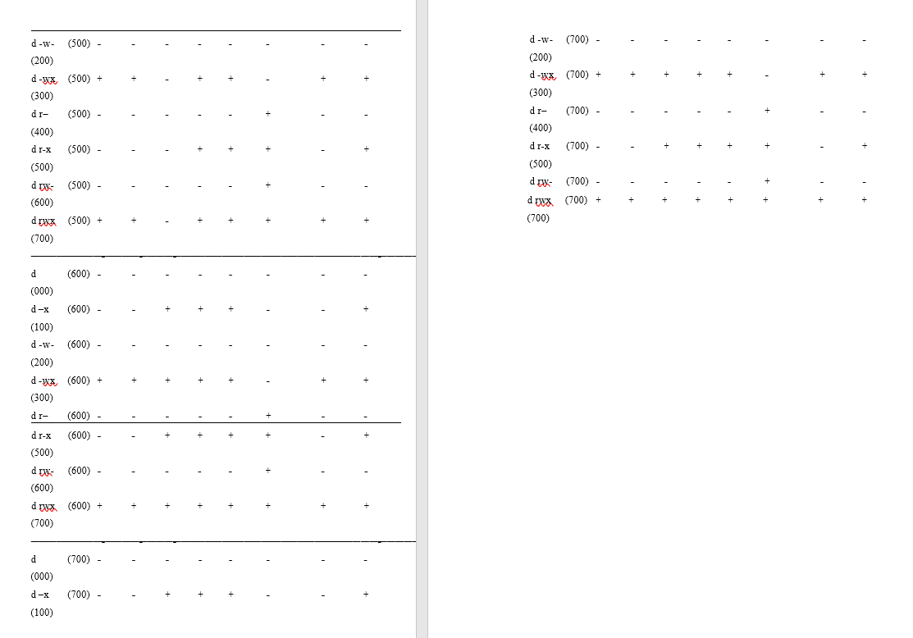

---
## Front matter
lang: ru-RU
title: Отчёт по лабораторной работе №2
subtitle: Простейший шаблон
author:
  - Абрамян А. А.
institute:
  - Российский университет дружбы народов, Москва, Россия
date: 2023, 09 сентября Москва, Россия

## i18n babel
babel-lang: russian
babel-otherlangs: english

## Formatting pdf
toc: false
toc-title: Содержание
slide_level: 2
aspectratio: 169
section-titles: true
theme: metropolis
header-includes:
 - \metroset{progressbar=frametitle,sectionpage=progressbar,numbering=fraction}
 - '\makeatletter'
 - '\beamer@ignorenonframefalse'
 - '\makeatother'
---

## Прагматика

- решить поставленную задчу;
- решить возникающие трудности и проблемы;
- практически получить полезный результат;

## Цель работы

- В данной лабораторной работе мне было необходимо получить практических навыки работы в консоли 
с атрибутами файлов, а также закрепление знаний теоретических основ дискреционного разграничения доступа в современных системах с открытым кодом на базе ОС Linux.

## Выполнение лабораторной работы

1. В установленной при выполнении предыдущей лабораторной работы
операционной системе создайте учётную запись пользователя guest (использую учётную запись администратора):
useradd guest. (рис. \ref{img1}) 

{ width=70% }

## Выполнение лабораторной работы

2. Задайте пароль для пользователя guest (использую учётную запись администратора):
passwd guest (рис. \ref{img2})

{ width=70% }

## Выполнение лабораторной работы

3. Войдите в систему от имени пользователя guest. (рис. \ref{img3})

{ width=70% }

## Выполнение лабораторной работы

4. Командой “pwd” определил, что нахожусь в директории /home/guest, которая
и является моей домашней директорией. 
Уточнил имя пользователя командой "whoami": guest
Уточнил имя пользователя, группу, а также группы, куда входит пользователь, командой id:
guest, uid = 1001 (guest), gid = 1001 (guest). Затем сравнил полученную информацию с
выводом команды "groups": "guest". Пользователь "guest" входит только в одну группу, состоящую из него самого, поэтому вывод обеих команд
совпадает. Данные, выводимые в приглашении командной
строки, совпадают с полученной информацией. (рис. \ref{img4}) 

{ width=70% }

## Выполнение лабораторной работы

5. Просмотрите файл /etc/passwd командой cat /etc/passwd
Найдите в нём свою учётную запись. 
Uid = 1001, gid = 1001, они совпадают с теми, что мы получили ранее. (рис. \ref{img5})

{ width=70% } 

## Выполнение лабораторной работы

6. Определите существующие в системе директории командой
ls -l /home/
Список поддиректорий директории /home получить удалось.
На директориях установлены права чтения, записи и выполнения для самого пользователя.
Проверьте, какие расширенные атрибуты установлены на поддиректориях, находящихся в директории /home, командой:
lsattr /home
Удалось увидеть расширенные атрибуты только директории того пользователя, от имени
которого я нахожусь в системе. (рис. \ref{img6}) 

{ width=70% }

## Выполнение лабораторной работы

7. Создайте в домашней директории поддиректорию dir1 командой
mkdir dir1
Определите командами ls -l и lsattr, какие права доступа и расширенные атрибуты были выставлены на директорию dir1:
чтение, запись и выполнение доступны для самого пользователя и для
группы, для остальных - только чтение и выполнение, расширенных атрибутов
не установлено 
Снимите с директории dir1 все атрибуты командой chmod 000 dir1
и проверьте с её помощью правильность выполнения команды ls -l:
все атрибуты были сняты 
Попытайтесь создать в директории dir1 файл file1 командой
echo "test"  "/home/guest/dir1/file1":
Этого сделать не получилось, т.к. мы убрали право доступа на запись в директории.
действительно ли файл file1 не находится внутри директории dir1: да (рис. \ref{img7})

{ width=70% }

## Выполнение лабораторной работы

8. Заполните таблицу «Установленные права и разрешённые действия»
(см. табл. 2.1), выполняя действия от имени владельца директории (файлов), определив опытным путём, какие операции разрешены, а какие нет.
Если операция разрешена, занесите в таблицу знак «+», если не разрешена, знак «-».(рис. \ref{img8})

{ width=70% }
{ width=70% }

## Выполнение лабораторной работы

9. Заполним таблицу "Минимальные права для совершения операций".(рис. \ref{img9})

{ width=70% }

## Результаты

- В данной лабораторной работе мне успешно удалось получить практических навыки работы в консоли 
с атрибутами файлов, а также закрепление знаний теоретических основ дискреционного разграничения доступа в современных системах с открытым кодом на базе ОС Linux.

