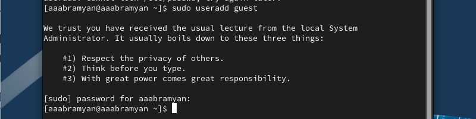
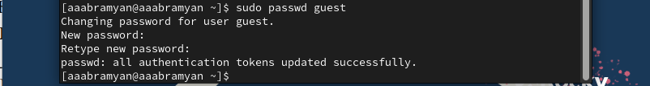
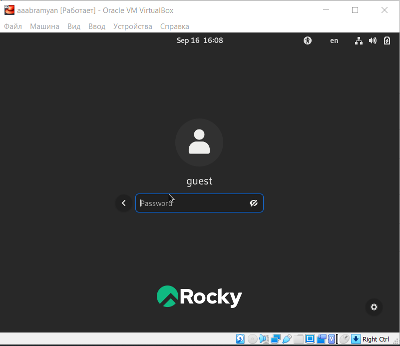
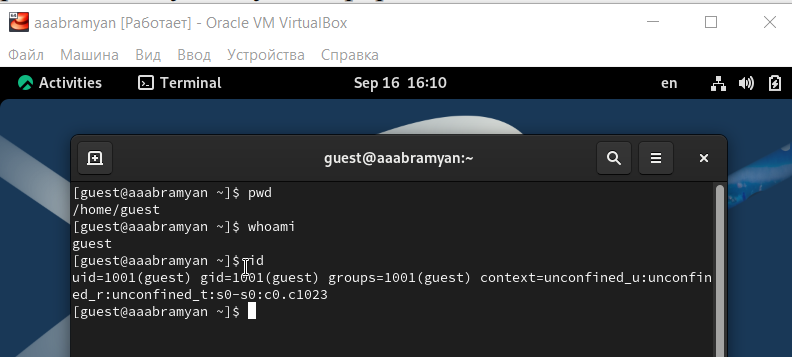
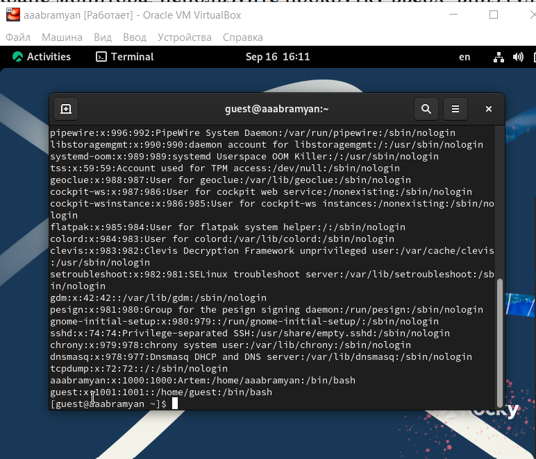
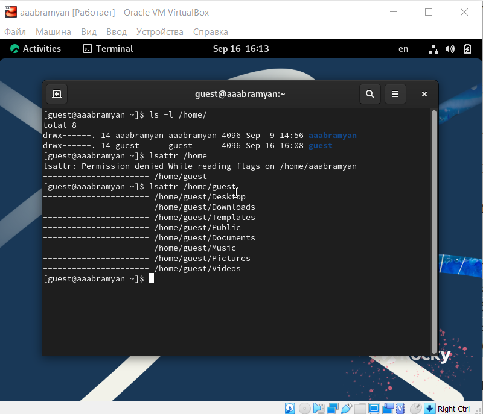
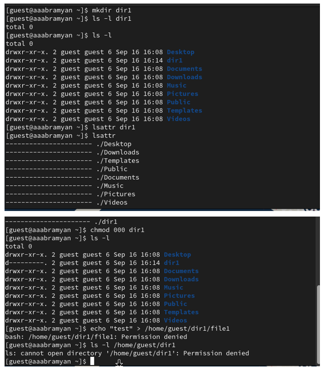
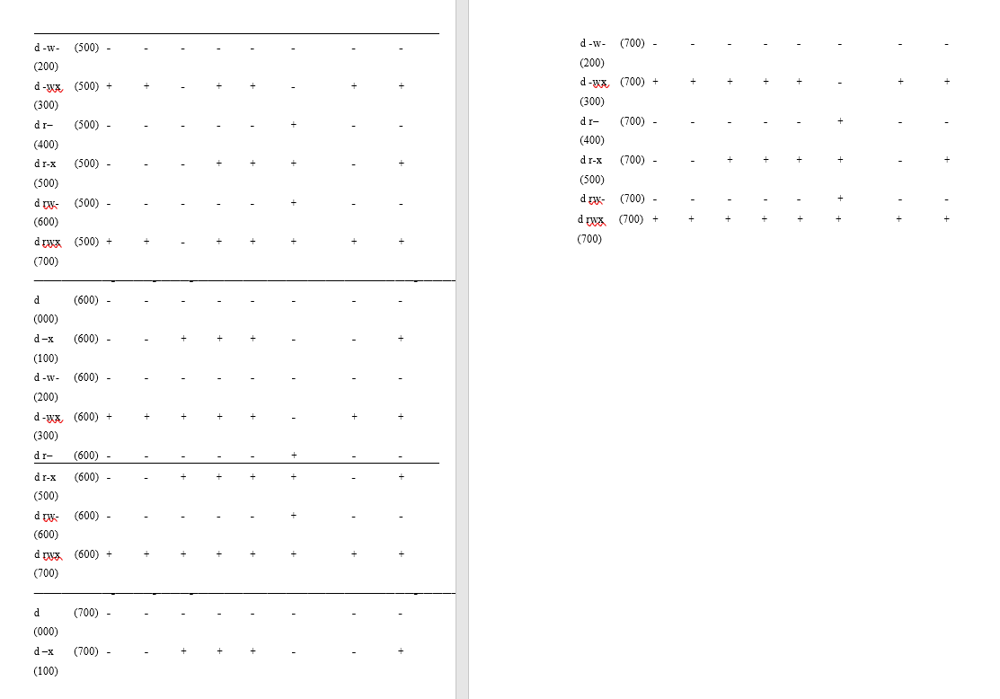
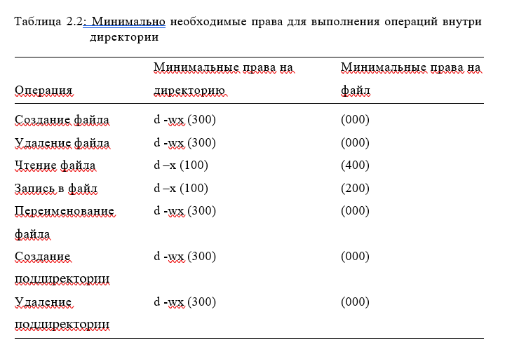

---
## Front matter
title: "Отчёт по лабораторной работе №2"
subtitle: "дисциплина: Информационная безопасность"
author: "Абрамян Артём Арменович"

## Generic otions
lang: ru-RU
toc-title: "Содержание"

## Bibliography
bibliography: bib/cite.bib
csl: pandoc/csl/gost-r-7-0-5-2008-numeric.csl

## Pdf output format
toc: true # Table of contents
toc-depth: 2
lof: true # List of figures
lot: true # List of tables
fontsize: 12pt
linestretch: 1.5
papersize: a4
documentclass: scrreprt
## I18n polyglossia
polyglossia-lang:
  name: russian
  options:
	- spelling=modern
	- babelshorthands=true
polyglossia-otherlangs:
  name: english
## I18n babel
babel-lang: russian
babel-otherlangs: english
## Fonts
mainfont: PT Serif
romanfont: PT Serif
sansfont: PT Sans
monofont: PT Mono
mainfontoptions: Ligatures=TeX
romanfontoptions: Ligatures=TeX
sansfontoptions: Ligatures=TeX,Scale=MatchLowercase
monofontoptions: Scale=MatchLowercase,Scale=0.9
## Biblatex
biblatex: true
biblio-style: "gost-numeric"
biblatexoptions:
  - parentracker=true
  - backend=biber
  - hyperref=auto
  - language=auto
  - autolang=other*
  - citestyle=gost-numeric
## Pandoc-crossref LaTeX customization
figureTitle: "Рис."
tableTitle: "Таблица"
listingTitle: "Листинг"
lofTitle: "Список иллюстраций"
lotTitle: "Список таблиц"
lolTitle: "Листинги"
## Misc options
indent: true
header-includes:
  - \usepackage{indentfirst}
  - \usepackage{float} # keep figures where there are in the text
  - \floatplacement{figure}{H} # keep figures where there are in the text
---

# Цель работы

В данной лабораторной работе мне было необходимо получить практических навыки работы в консоли 
с атрибутами файлов, а также закрепление знаний теоретических основ дискреционного разграничения доступа в современных системах с открытым кодом на базе ОС Linux.

# Теоретическое введение

Выполнение работы возможно как в дисплейном классе факультета
физико-математических и естественных наук РУДН, так и дома. Описание
выполнения работы приведено для дисплейного класса со следующими характеристиками:
– Intel Core i3-550 3.2 GHz, 4 GB оперативной памяти, 20 GB свободного
места на жёстком диске;
– ОС Linux Gentoo (http://www.gentoo.ru/);
– VirtualBox верс. 6.1 или старше;
– каталог с образами ОС для работающих в дисплейном классе:
/afs/dk.sci.pfu.edu.ru/common/files/iso/.

В случае, когда вывод команды не умещается на одном
экране монитора, используйте прокрутку вверх–вниз (удерживая клавишу shift, нажимайте page up и page down) либо программу grep в
качестве фильтра для вывода только строк, содержащих определённые
буквенные сочетания:
cat /etc/passwd | grep guest

# Выполнение лабораторной работы

1. В установленной при выполнении предыдущей лабораторной работы
операционной системе создайте учётную запись пользователя guest (использую учётную запись администратора):
useradd guest. (рис. \ref{img1}) 

{ width=70% }

2. Задайте пароль для пользователя guest (использую учётную запись администратора):
passwd guest (рис. \ref{img2})

{ width=70% }

3. Войдите в систему от имени пользователя guest. (рис. \ref{img3})

{ width=70% }

4. Командой “pwd” определил, что нахожусь в директории /home/guest, которая
и является моей домашней директорией. 
Уточнил имя пользователя командой "whoami": guest
Уточнил имя пользователя, группу, а также группы, куда входит пользователь, командой id:
guest, uid = 1001 (guest), gid = 1001 (guest). Затем сравнил полученную информацию с
выводом команды "groups": "guest". Пользователь "guest" входит только в одну группу, состоящую из него самого, поэтому вывод обеих команд
совпадает. Данные, выводимые в приглашении командной
строки, совпадают с полученной информацией. (рис. \ref{img4}) 

{ width=70% }

5. Просмотрите файл /etc/passwd командой cat /etc/passwd
Найдите в нём свою учётную запись. 
Uid = 1001, gid = 1001, они совпадают с теми, что мы получили ранее. (рис. \ref{img5})

{ width=70% } 

6. Определите существующие в системе директории командой
ls -l /home/
Список поддиректорий директории /home получить удалось.
На директориях установлены права чтения, записи и выполнения для самого пользователя.
Проверьте, какие расширенные атрибуты установлены на поддиректориях, находящихся в директории /home, командой:
lsattr /home
Удалось увидеть расширенные атрибуты только директории того пользователя, от имени
которого я нахожусь в системе. (рис. \ref{img6}) 

{ width=70% }

7. Создайте в домашней директории поддиректорию dir1 командой
mkdir dir1
Определите командами ls -l и lsattr, какие права доступа и расширенные атрибуты были выставлены на директорию dir1:
чтение, запись и выполнение доступны для самого пользователя и для
группы, для остальных - только чтение и выполнение, расширенных атрибутов
не установлено 
Снимите с директории dir1 все атрибуты командой chmod 000 dir1
и проверьте с её помощью правильность выполнения команды ls -l:
все атрибуты были сняты 
Попытайтесь создать в директории dir1 файл file1 командой
echo "test"  "/home/guest/dir1/file1":
Этого сделать не получилось, т.к. мы убрали право доступа на запись в директории.
действительно ли файл file1 не находится внутри директории dir1: да (рис. \ref{img7})

{ width=70% }

8. Заполните таблицу «Установленные права и разрешённые действия»
(см. табл. 2.1), выполняя действия от имени владельца директории (файлов), определив опытным путём, какие операции разрешены, а какие нет.
Если операция разрешена, занесите в таблицу знак «+», если не разрешена, знак «-».(рис. \ref{img8})

{ width=70% }
{ width=70% }

9. Заполним таблицу "Минимальные права для совершения операций".(рис. \ref{img9})

{ width=70% }

# Выводы

В данной лабораторной работе мне успешно удалось получить практических навыки работы в консоли 
с атрибутами файлов, а также закрепление знаний теоретических основ дискреционного разграничения доступа в современных системах с открытым кодом на базе ОС Linux.

# Библиографический список

1. Документация Rocky (https://docs.rockylinux.org/)

