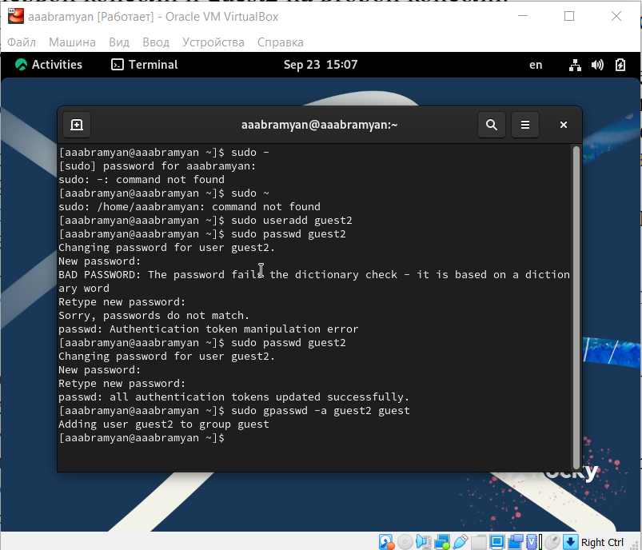
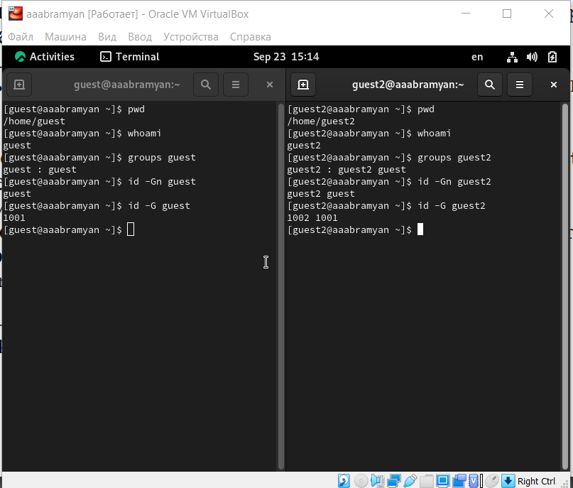
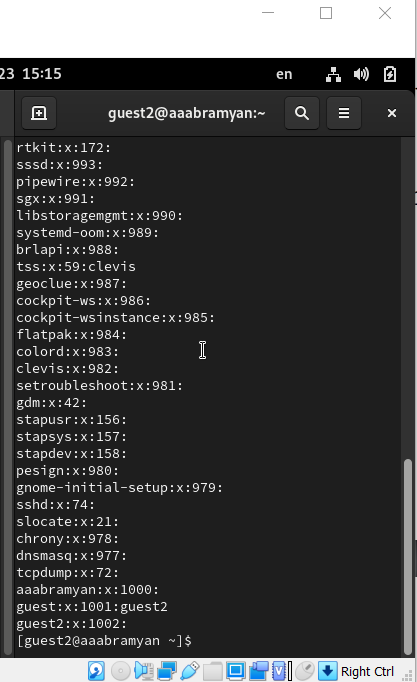
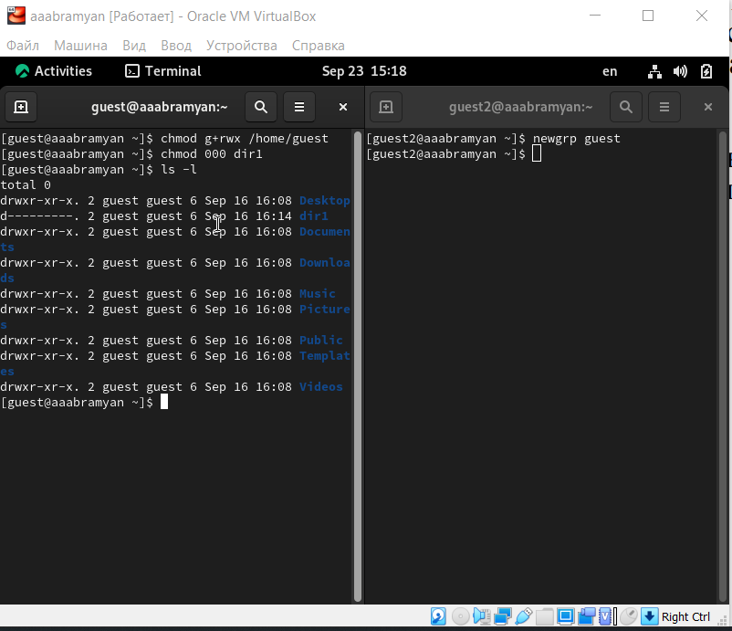
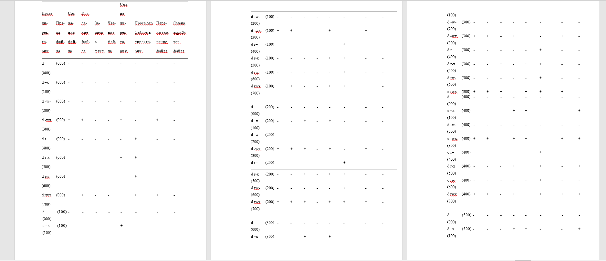
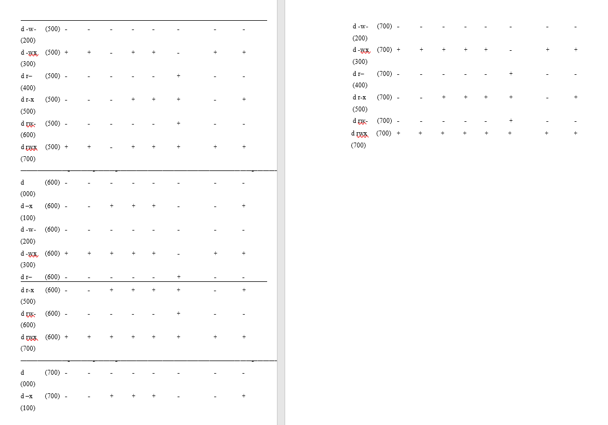

---
## Front matter
title: "Отчёт по лабораторной работе №3"
subtitle: "дисциплина: Информационная безопасность"
author: "Абрамян Артём Арменович"

## Generic otions
lang: ru-RU
toc-title: "Содержание"

## Bibliography
bibliography: bib/cite.bib
csl: pandoc/csl/gost-r-7-0-5-2008-numeric.csl

## Pdf output format
toc: true # Table of contents
toc-depth: 2
lof: true # List of figures
lot: true # List of tables
fontsize: 12pt
linestretch: 1.5
papersize: a4
documentclass: scrreprt
## I18n polyglossia
polyglossia-lang:
  name: russian
  options:
	- spelling=modern
	- babelshorthands=true
polyglossia-otherlangs:
  name: english
## I18n babel
babel-lang: russian
babel-otherlangs: english
## Fonts
mainfont: PT Serif
romanfont: PT Serif
sansfont: PT Sans
monofont: PT Mono
mainfontoptions: Ligatures=TeX
romanfontoptions: Ligatures=TeX
sansfontoptions: Ligatures=TeX,Scale=MatchLowercase
monofontoptions: Scale=MatchLowercase,Scale=0.9
## Biblatex
biblatex: true
biblio-style: "gost-numeric"
biblatexoptions:
  - parentracker=true
  - backend=biber
  - hyperref=auto
  - language=auto
  - autolang=other*
  - citestyle=gost-numeric
## Pandoc-crossref LaTeX customization
figureTitle: "Рис."
tableTitle: "Таблица"
listingTitle: "Листинг"
lofTitle: "Список иллюстраций"
lotTitle: "Список таблиц"
lolTitle: "Листинги"
## Misc options
indent: true
header-includes:
  - \usepackage{indentfirst}
  - \usepackage{float} # keep figures where there are in the text
  - \floatplacement{figure}{H} # keep figures where there are in the text
---

# Цель работы

В данной лабораторной работе мне было необходимо полученить практические навыки работы в консоли с атрибутами файлов для групп пользователей.

# Теоретическое введение

Выполнение работы возможно как в дисплейном классе факультета
физико-математических и естественных наук РУДН, так и дома. Описание
выполнения работы приведено для дисплейного класса со следующими характеристиками:
– Intel Core i3-550 3.2 GHz, 4 GB оперативной памяти, 20 GB свободного
места на жёстком диске;
– ОС Linux Gentoo (http://www.gentoo.ru/);
– VirtualBox верс. 6.1 или старше;
– каталог с образами ОС для работающих в дисплейном классе:
/afs/dk.sci.pfu.edu.ru/common/files/iso/.

В операционной системе Linux есть много отличных функций безопасности, но
одна из самых важных - это система прав доступа к файлам. Изначально каждый
файл имел три параметра доступа:
Чтение - разрешает получать содержимое файла, но на запись нет. Для
каталога позволяет получить список файлов и каталогов, расположенных в
нем
Запись - разрешает записывать новые данные в файл или изменять существующие, а также позволяет создавать и изменять файлы и каталоги
Выполнение - невозможно выполнить программу, если у нее нет флага
выполнения. Этот атрибут устанавливается для всех программ и скриптов, именно с помощью него система может понять, что этот файл нужно
запускать как программу
Каждый файл имеет три категории пользователей, для которых можно устанавливать различные сочетания прав доступа:

Владелец - набор прав для владельца файла, пользователя, который его
создал или сейчас установлен его владельцем. Обычно владелец имеет все
права, чтение, запись и выполнение
Группа - любая группа пользователей, существующая в системе и привязанная к файлу. Но это может быть только одна группа и обычно это группа
владельца, хотя для файла можно назначить и другую группу
Остальные - все пользователи, кроме владельца и пользователей, входящих
в группу файла

Команды, которые могут понадобиться при работе с правами доступа:
“ls -l” - для просмотра прав доступа к файлам и каталогам
“chmod категория действие флаг файл или каталог” - для изменения прав
доступа к файлам и каталогам (категорию действие и флаг можно заменить
на набор из трех цифр от 0 до 7)
Значения флагов прав:
— - нет никаких прав
–x - разрешено только выполнение файла, как программы, но не изменение
и не чтение
-w- - разрешена только запись и изменение файла
-wx - разрешено изменение и выполнение, но в случае с каталогом, невозможно посмотреть его содержимое
r– - права только на чтение
r-x - только чтение и выполнение, без права на запись
rw- - права на чтение и запись, но без выполнения
rwx - все права

# Выполнение лабораторной работы

1. В установленной операционной системе создайте учётную запись пользователя guest2 (использую учётную запись администратора):
useradd guest.
Задайте пароль для пользователя guest2 (использую учётную запись администратора):
passwd guest.
Добавьте пользователя guest2 в группу guest:
gpasswd -a guest2 guest (рис. \ref{img1}) 

{ width=70% }

2. Осуществите вход в систему от двух пользователей на двух разных консолях: guest на первой консоли и guest2 на второй консоли.
Для обоих пользователей командой pwd определите директорию, в которой вы находитесь. Сравните её с приглашениями командной строки:
оба пользователя находятся в своих домашних директориях, что совпадает с
приглашениями командной строки.
Уточните имя вашего пользователя, его группу, кто входит в неё
и к каким группам принадлежит он сам. Определите командами
groups guest и groups guest2, в какие группы входят пользователи guest и guest2. Сравните вывод команды groups с выводом команд
id -Gn и id -G:
Вывел имена пользователей командой
"whoami": guest и guest2. С помощью команд "groups guest" и "groups guest2" определил, что пользователь guest входит в группу guest,
а пользователь guest2 в группы guest и guest2. Сравнил полученную информацию с выводом команд "id -Gn guest", "id -Gn guest2", "id -G guest" и "id -G guest2":
данные совпали, кроме команды “id -G”, которая вывела номера
групп 1001 и 1002, что также является верным
 (рис. \ref{img2})

{ width=70% }

3. Сравните полученную информацию с содержимым файла /etc/group.
Просмотрите файл командой
cat /etc/group: 
данные этого файла совпадают с полученными ранее (рис. \ref{img3})

{ width=70% }

4. От имени пользователя guest2 выполните регистрацию пользователя
guest2 в группе guest командой
newgrp guest.
От имени пользователя guest измените права директории /home/guest,
разрешив все действия для пользователей группы:
chmod g+rwx /home/guest
От имени пользователя guest снимите с директории /home/guest/dir1
все атрибуты командой
chmod 000 dirl 
и проверьте правильность снятия атрибутов. (рис. \ref{img4}) 

{ width=70% }

5. Меняя атрибуты у директории dir1 и файла file1 от имени пользователя guest и делая проверку от пользователя guest2, заполните табл. 3.1,
определив опытным путём, какие операции разрешены, а какие нет. Если операция разрешена, занесите в таблицу знак «+», если не разрешена,
знак «-».
Сравнивая полученную таблицу с таблицей из прошлой лабораторной работы, видим, что изменился только последний столбец, позволяющий
изменять атрибуты у файла: теперь это сделать невозможно, у владельца
файла и директории нет на это прав. (рис. \ref{img5})

{ width=70% }
{ width=70% }

6. Заполним таблицу «Минимально необходимые права для выполнения операций внутри директории». (рис. \ref{img7}) 

{ width=70% }

# Выводы

В данной лабораторной работе мне успешно удалось получить практические навыки работы в консоли с атрибутами файлов для групп пользователей.

# Библиографический список

1. Документация Rocky (https://docs.rockylinux.org/)

