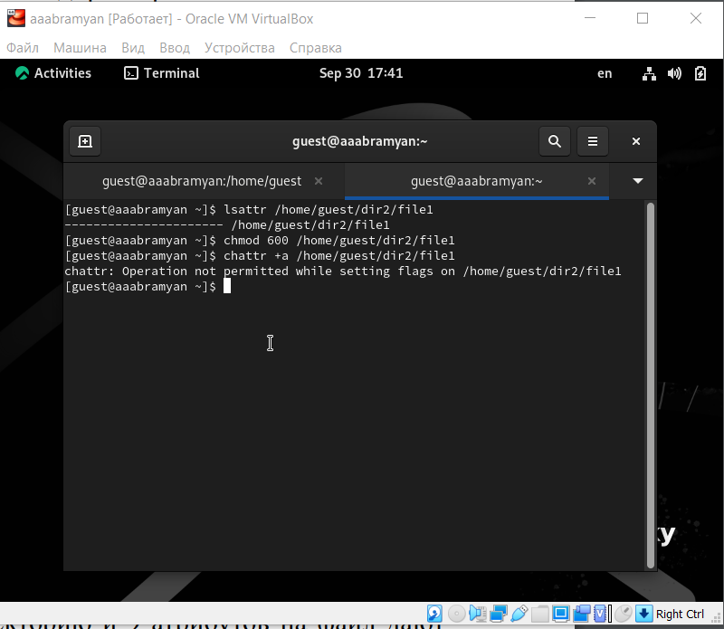
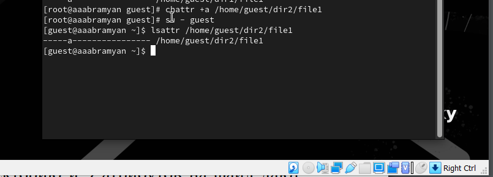
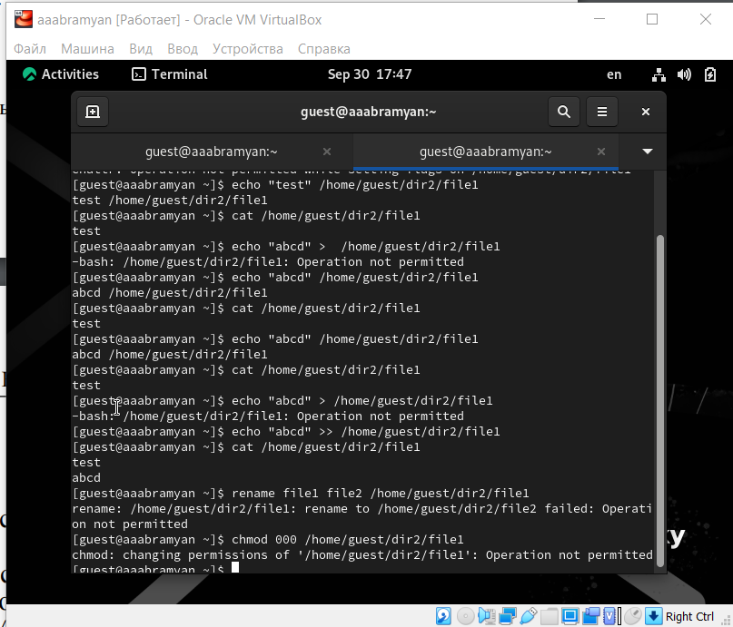
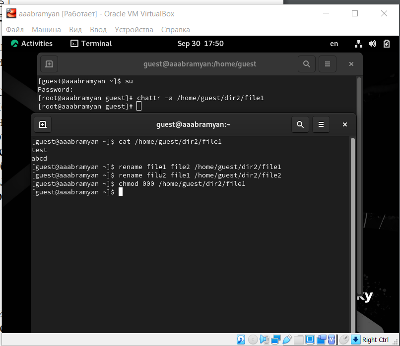
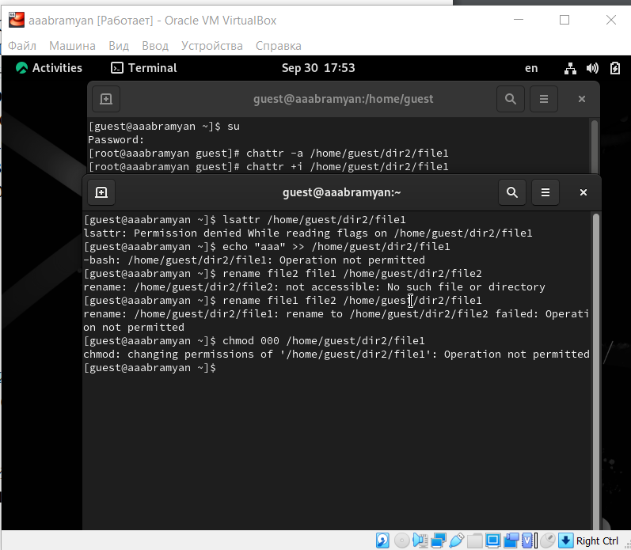

---
## Front matter
lang: ru-RU
title: Отчёт по лабораторной работе №4
subtitle: Простейший шаблон
author:
  - Абрамян А. А.
institute:
  - Российский университет дружбы народов, Москва, Россия
date: 2023, 30 сентября Москва, Россия

## i18n babel
babel-lang: russian
babel-otherlangs: english

## Formatting pdf
toc: false
toc-title: Содержание
slide_level: 2
aspectratio: 169
section-titles: true
theme: metropolis
header-includes:
 - \metroset{progressbar=frametitle,sectionpage=progressbar,numbering=fraction}
 - '\makeatletter'
 - '\beamer@ignorenonframefalse'
 - '\makeatother'
---

## Прагматика

- решить поставленную задчу;
- решить возникающие трудности и проблемы;
- практически получить полезный результат;

## Цель работы

- В данной лабораторной работе мне было необходимо получить практические навыки работы в консоли с расширенными атрибутами файлов.

## Выполнение лабораторной работы

1. От имени пользователя guest определил расширенные атрибуты файла /home/guest/dir1/file1 командой “lsattr /home/guest/dir1/file1”. Командой
“chmod 600 /home/guest/dir1/file1” установил права, разрешающие чтение и
запись для владельца файла. При попытке использовать команду “chattr +a
/home/guest/dir1/file1” для установления расширенного атрибута “a” получил
отказ в выполнении операции (рис. \ref{img1}) 

{ width=70% }

## Выполнение лабораторной работы

2. От имени суперпользователя установил расширенный атрибут “a” на
файл командой “sudo chattr +a /home/guest/dir1/file1” и 
от имени пользователя guest проверил правильность  атрибута командой “lsattr /home/guest/dir1/file1”
 (рис. \ref{img2})

{ width=70% }

## Выполнение лабораторной работы

3. Дозаписал в файл file1 слово “test” командой “echo”test” » /home/guest/dir1/file1”
и, используя команду “cat /home/guest/dir1/file1” убедился, что указанное
ранее слово было успешно записано в наш файл. Записала в файл
слово “abcd”. Далее попробовал стереть имеющуюся в файле информацию
командой “echo”abcd”  /home/guest/dirl/file1”, но получил отказ. Попробовал
переименовать файл командой “rename file1 file2 /home/guest/dirl/file1” и
изменить права доступа командой “chmod 000 /home/guest/dirl/file1” и также
получил отказ  (рис. \ref{img3})

{ width=70% }

## Выполнение лабораторной работы

4. Снял расширенный атрибут“a” с файла от имени суперпользователя командой
“sudo chattr -a /home/guest/dir1/file1” и повторил операции, которые ранее не
получилось выполнить. теперь ошибок не было, операции были выполнены (рис. \ref{img4}) 

{ width=70% }

## Выполнение лабораторной работы

5. От имени суперпользователя командой “sudo chattr +i /home/guest/dir1/file1”
установил расширенный атрибут “i” и повторил действия, которые выполнял
ранее. В данном случае файл можно было только прочитать, а изменить
в него что-то, переименовать и изменить его атрибуты нельзя. (рис. \ref{img5})

{ width=70% }

## Выполнение лабораторной работы

## Результаты

- В данной лабораторной работе мне успешно удалось получить практические навыки работы в консоли с расширенными атрибутами файлов.

