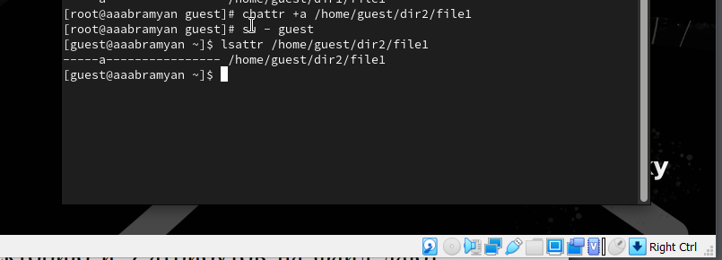
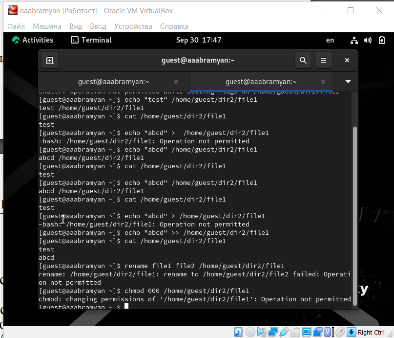
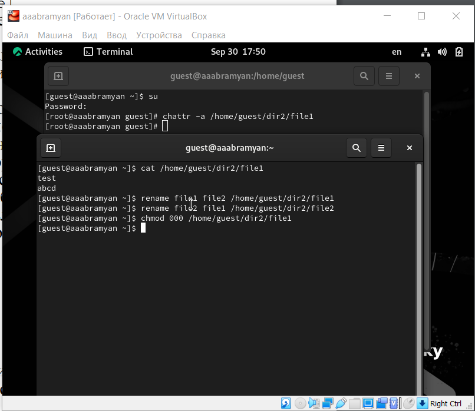
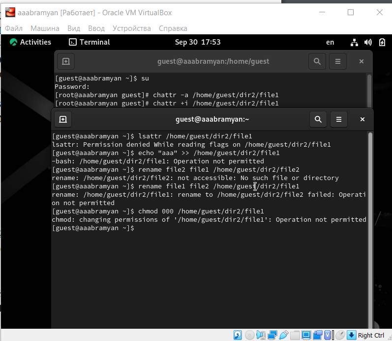

---
## Front matter
lang: ru-RU
title: Отчёт по лабораторной работе №5
subtitle: Простейший шаблон
author:
  - Абрамян А. А.
institute:
  - Российский университет дружбы народов, Москва, Россия
date: 2023, 30 сентября Москва, Россия

## i18n babel
babel-lang: russian
babel-otherlangs: english

## Formatting pdf
toc: false
toc-title: Содержание
slide_level: 2
aspectratio: 169
section-titles: true
theme: metropolis
header-includes:
 - \metroset{progressbar=frametitle,sectionpage=progressbar,numbering=fraction}
 - '\makeatletter'
 - '\beamer@ignorenonframefalse'
 - '\makeatother'
---

## Прагматика

- решить поставленную задчу;
- решить возникающие трудности и проблемы;
- практически получить полезный результат;

## Цель работы

- В данной лабораторной работе мне было необходимо Изучение механизмов изменения идентификаторов, применения SetUID- и
Sticky-битов. Получение практических навыков работы в консоли с дополнительными атрибутами. Рассмотрение работы механизма смены идентификатора
процессов пользователей, а также влияние бита Sticky на запись и удаление
файлов..

## Выполнение лабораторной работы

1. Убедился, что компилятор gcc установлен, исолпьзуя команду
“gcc -v”. Затем отключил систему запретов до очередной перезагрузки системы
командой “sudo setenforce 0”, после чего команда “getenforce” вывела “Permissive”
 (рис. \ref{img1}) 

{ width=70% }

## Выполнение лабораторной работы

2. Проверил успешное выполнение команд “whereis gcc” и “whereis g++”.
 (рис. \ref{img2})

{ width=70% }

## Выполнение лабораторной работы

3. Вошел в систему от имени пользователя guest командой “su - guest”. 
Создал программу simpleid.c командой “touch simpleid.c” и открыл её в редакторе
командой “gedit /home/guest/simpleid.c”   (рис. \ref{img3})

{ width=70% }

## Выполнение лабораторной работы

4. Скомпилировал программу и убедился, что файл программы был создан
командой “gcc simpleid.c -o simpleid”. Выполнил программу simpleid командой
“./simpleid”, а затем выполнил системную программу id командой “id”. Результаты, полученные в результате выполнения обеих команд, совпадают (uid=1001 и
gid=1001) (рис. \ref{img4}) 

{ width=70% }
{ width=70% }

## Выполнение лабораторной работы

5. От имени суперпользователя выполнил команды “sudo chown root:guest
/home/guest/simpleid2” и “sudo chmod u+s /home/guest/simpleid2”, затем выполнил проверку правильности установки новых атрибутов и смены владельца
файла simpleid2 командой “sudo ls -l /home/guest/simpleid2”. Этими
командами была произведена смена пользователя файла на root и установлен
SetUID-бит. (рис. \ref{img5})

{ width=70% }
## Выполнение лабораторной работы

6. Поменял владельца у программы readfile и устанавил SetUID. Проверил, может ли программа readfile прочитать файл readfile.c командой “./readfile readfile.c”.
Прочитать удалось. Проверил, можно ли прочитать файл /etc/shadow.
Прочитать удалось (рис. \ref{img6})

{ width=70% }
## Выполнение лабораторной работы
7. Командой “ls -l / | grep tmp” убедился, что атрибут Sticky на директории /tmp
установлен. От имени пользователя guest создал файл file01.txt в директории
/tmp со словом test командой “echo”test” > /tmp/file01.txt”. Просмотрел атрибуты
у только что созданного файла и разрешил чтение и запись для категории
пользователей “все остальные” командами “ls -l /tmp/file01.txt” и “chmod o+rw
/tmp/file01.txt”  (рис. \ref{img7})

{ width=70% }

## Выполнение лабораторной работы
8. От имени пользователя guest2 попробовал прочитать файл командой “cat
/tmp/file01.txt” - это удалось. Далее попытался дозаписать в файл слово test2,
проверить содержимое файла и записать в файл слово test3, стерев при этом всю
имеющуюся в файле информацию - эти операции удалось выполнить только в
случае, если еще дополнительно разрешить чтение и запись для группы пользователей командой “chmod g+rw /tmp/file01.txt”. От имени пользователя guest2
попробовал удалить файл - это не удается ни в каком из случаев, возникает
ошибка (рис. \ref{img8})

{ width=70% }
## Выполнение лабораторной работы
9. Повысил права до суперпользователя командой “su -” и выполнил команду,
снимающую атрибут t с директории /tmp “chmod -t /tmp”. После чего покинул
режим суперпользователя командой “exit”. Повторил предыдущие шаги. Теперь
мне удалось удалить файл file01.txt от имени пользователя, не являющегося его
владельцем  (рис. \ref{img9})

{ width=70% }

## Выполнение лабораторной работы

10. Повысил права до суперпользователя командой “su -” и выполнил команду,
снимающую атрибут t с директории /tmp “chmod -t /tmp”. После чего покинул
режим суперпользователя командой “exit”. Повторил предыдущие шаги. Теперь
мне удалось удалить файл file01.txt от имени пользователя, не являющегося его
владельцем.
Повысил свои права до суперпользователя и вернул атрибут t на директорию
/tmp  (рис. \ref{img9})

{ width=70% }

## Выполнение лабораторной работы

## Результаты

- В данной лабораторной работе мне успешно удалось Изучение механизмов изменения идентификаторов, применения SetUID- и
Sticky-битов. Получение практических навыков работы в консоли с дополнительными атрибутами. Рассмотрение работы механизма смены идентификатора
процессов пользователей, а также влияние бита Sticky на запись и удаление
файлов.

