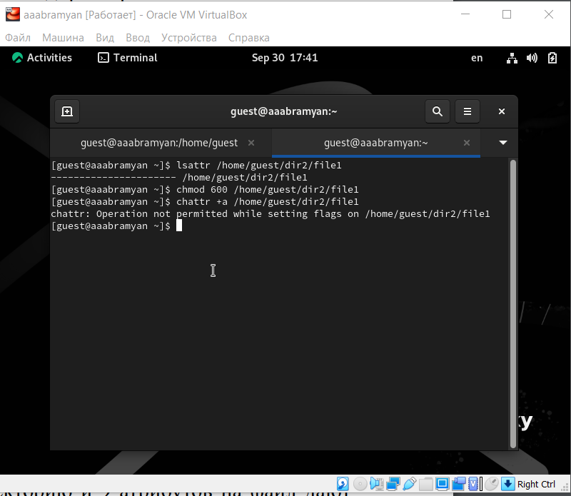

---
## Front matter
lang: ru-RU
title: Отчёт по лабораторной работе №6
subtitle: Простейший шаблон
author:
  - Абрамян А. А.
institute:
  - Российский университет дружбы народов, Москва, Россия
date: 2023, 30 сентября Москва, Россия

## i18n babel
babel-lang: russian
babel-otherlangs: english

## Formatting pdf
toc: false
toc-title: Содержание
slide_level: 2
aspectratio: 169
section-titles: true
theme: metropolis
header-includes:
 - \metroset{progressbar=frametitle,sectionpage=progressbar,numbering=fraction}
 - '\makeatletter'
 - '\beamer@ignorenonframefalse'
 - '\makeatother'
---

## Прагматика

- решить поставленную задчу;
- решить возникающие трудности и проблемы;
- практически получить полезный результат;

## Цель работы

- Развить навыки администрирования ОС Linux. 
Получить первое практическое знакомство с технологией SELinux. Проверить работу SELinux на практике
совместно с веб-сервером Apache.

## Выполнение лабораторной работы

1. Вошёл в систему под своей учетной записью и убедилась, что SELinux работает
в режиме enforcing политики targeted с помощью команд “getenforce” и “sestatus”
 (рис. \ref{img1}) 

{ width=70% }

## Выполнение лабораторной работы

2. Обратился с помощью браузера к веб-серверу, запущенному на моем компьютере, убедился, что последний работает с помощью команды “service httpd
status” 
 (рис. \ref{img2})

{ width=70% }

## Выполнение лабораторной работы

3. С помощью команды “ps auxZ | grep httpd” определил контекст безопасности
веб-сервера Apache - httpd_t   (рис. \ref{img3})

{ width=70% }

## Выполнение лабораторной работы

4. Посмотрел текущее состояние переключателей SELinux для Apache с помощью команды 
“sestatus -bigrep httpd”, многие из переключателей находятся в
положении “off” (рис. \ref{img4}) 

{ width=70% }

## Выполнение лабораторной работы

5. С помощью команды “ls -lZ /var/www” посмотрел файлы и поддиректории,
находящиеся в директории /var/www. Используя команду “ls -lZ /var/www/html”,
определил, что в данной директории файлов нет. 
Только владелец/суперпользователь может создавать файлы в директории /var/www/html (рис. \ref{img5})

{ width=70% }

## Выполнение лабораторной работы

6. Обратился к файлу через веб-сервер, введя в браузере адрес “http://127.0.0.1/test.html”.
Файл был успешно отображен.
Изучив справку man httpd_selinux, выяснил, что для httpd определены следующие контексты файлов: httpd_sys_content_t, httpd_sys_script_exec_t,
httpd_sys_script_ro_t, httpd_sys_script_rw_t, httpd_sys_script_ra_t, httpd_unconfined_script_exec_t.
Контекст моего файла - httpd_sys_content_t (в таком случае содержимое должно
быть доступно для всех скриптов httpd и для самого демона). Изменил
контекст файла на samba_share_t командой “sudo chcon -t samba_share_t
/var/www/html/test.html” и проверил, что контекст поменялся
(рис. \ref{img6})

{ width=70% }

## Выполнение лабораторной работы

7. Командой “ls -l /var/www/html/test.html” убедился, что читать данный файл может любой пользователь. Просмотрел системный лог-файл веб-сервера Apache
командой “sudo tail /var/log/messages”, отображающий ошибки  (рис. \ref{img7})

{ width=70% }

## Выполнение лабораторной работы

8. От имени пользователя guest2 попробовал прочитать файл командой “cat
/tmp/file01.txt” - это удалось. Далее попытался дозаписать в файл слово test2,
проверить содержимое файла и записать в файл слово test3, стерев при этом всю
имеющуюся в файле информацию - эти операции удалось выполнить только в
случае, если еще дополнительно разрешить чтение и запись для группы пользователей командой “chmod g+rw /tmp/file01.txt”. От имени пользователя guest2
попробовал удалить файл - это не удается ни в каком из случаев, возникает
ошибка (рис. \ref{img8})

{ width=70% }

9. Повысил права до суперпользователя командой “su -” и выполнил команду,
снимающую атрибут t с директории /tmp “chmod -t /tmp”. После чего покинул
режим суперпользователя командой “exit”. Повторил предыдущие шаги. Теперь
мне удалось удалить файл file01.txt от имени пользователя, не являющегося его
владельцем  (рис. \ref{img9})

{ width=70% }

## Выполнение лабораторной работы

10. Удалил файл “/var/www/html/test.html” командой “rm /var/www/html/test.html”
/tmp  (рис. \ref{img9})

{ width=70% }

## Выполнение лабораторной работы

10. Повысил права до суперпользователя командой “su -” и выполнил команду,
снимающую атрибут t с директории /tmp “chmod -t /tmp”. После чего покинул
режим суперпользователя командой “exit”. Повторил предыдущие шаги. Теперь
мне удалось удалить файл file01.txt от имени пользователя, не являющегося его
владельцем.
Повысил свои права до суперпользователя и вернул атрибут t на директорию
/tmp  (рис. \ref{img9})

{ width=70% }

## Выполнение лабораторной работы

## Результаты

- В данной лабораторной работе мне успешно удалось Развить навыки администрирования ОС Linux. 
Получить первое практическое знакомство с технологией SELinux. Проверить работу SELinux на практике
совместно с веб-сервером Apache.

